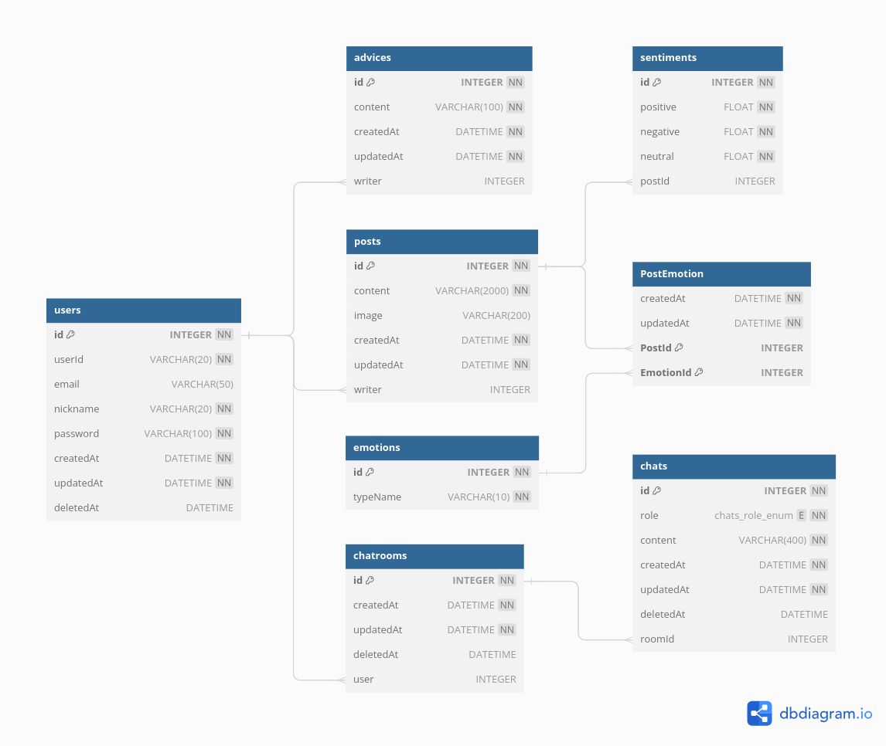

# AI 공감 일기장: 2024-1 서강대학교 AI융합캡스톤디자인과창업 프로젝트

**AI 공감 일기장** 서비스의 백엔드 리포지토리이다.

## 개발 환경 요약
- **Operating System**: Ubuntu 22.04
- **Runtime Environment**: node.js v20.9.0
- **Framework**: express.js
- **Database**: MySQL

## 데이터베이스 구조

### users: 사용자 테이블
| column | meaning |
| :-- | :-- |
| id | 로우 고유의 ID |
| userId | 로그인 시 사용되는 ID |
| email | 이메일 |
| nickname | 닉네임 |
| password | 비밀번호 |
| createdAt | 로우 생성 일시 |
| updatedAt | 로우 업데이트 일시 |
| deletedAt | 로우 삭제 일시 |

### advices: 조언 테이블
| column | meaning |
| :-- | :-- |
| id | 로우 고유의 ID |
| content | 조언 내용 |
| createdAt | 로우 생성 일시 |
| updatedAt | 로우 업데이트 일시 |
| writer | 조언 작성자 |

사용자는 일기를 작성한 후 자신과 비슷하거나 반대되는 감정을 가진 사람에게 조언할 수 있다.

### posts: 일기 테이블
| column | meaning |
| :-- | :-- |
| id | 로우 고유의 ID |
| content | 일기 내용 |
| image | 첨부된 이미지 경로 |
| createdAt | 로우 생성 일시 |
| updatedAt | 로우 업데이트 일시 |
| writer | 일기 작성자 |

사용자는 일기를 작성할 수 있다.

### emotions: 감정 테이블
| column | meaning |
| :-- | :-- |
| id | 로우 고유의 ID |
| typeName | 감정 명칭 |

일기에는 행복, 슬픔 등 여러 가지 감정이 매핑될 수 있다.

### PostEmotion: 감정과 일기의 다대다 매핑 테이블
| column | meaning |
| :-- | :-- |
| PostId | 일기의 고유한 ID |
| EmotionId | 감정의 고유한 ID |
| createdAt | 로우 생성 일시 |
| updatedAt | 로우 업데이트 일시 |

행복, 슬픔 등의 특정한 감정은 어떤 일기에도 매핑될 수 있다.

### sentiments: 감성 테이블
| column | meaning |
| :-- | :-- |
| id | 로우 고유의 ID |
| positive | 긍정 확률 |
| negative | 부정 확률 |
| neutral | 중립 확률 |
| postId | 일기의 고유한 ID |

일기의 내용으로 감성 분석을 수행하면 긍정적일 확률, 부정적일 확률, 중립적일 확률이 추출된다. 이 정보는 일기마다 고유하게 매핑된다.

### chatrooms: 대화방 테이블
| column | meaning |
| :-- | :-- |
| id | 로우 고유의 ID |
| userId | 대화 사용자 ID |
| createdAt | 대화 시작 일시 |
| updatedAt | 로우 수정 일시 |
| deletedAt | 로우 삭제 일시 |

사용자는 일기를 작성하기 위해 AI 챗봇과 대화를 시작할 수 있다. 이때 대화방이 생성된다.

### chats: 대화 테이블
| column | meaning |
| :-- | :-- |
| id | 로우 고유의 ID |
| roomId | 대화방의 ID |
| role | 메시지 생성자(AI or 사용자) |
| content | 메시지 내용 |
| createdAt | 대화 전송 일시 |
| updatedAt | 로우 수정 일시 |
| deletedAt | 로우 삭제 일시 |

## RESTful API

### 회원

회원과 관련된 정보들을 관리한다.

| HTTP method | URI | API ID | role |
| :--: | :-- | :--: | :-- |
| GET | /users | u-01 | 회원 정보 조회 |
| POST | /users | u-02 | 회원 가입 |
| POST | /users/login | u-03 | 로그인 |
| PATCH | /users | u-04 | 회원 정보 수정 |
| DELETE | /users | u-05 | 회원 탈퇴 |

### 일기

일기와 관련된 정보들을 관리한다.

| HTTP method | URI | API ID | role |
| :--: | :-- | :--: | :-- |
| GET | /posts | p-01 | 사용자의 모든 일기 조회 |
| GET | /posts/{postId} | p-02 | 사용자의 특정 일기 조회 |
| POST | /posts | p-03 | 일기 등록 |
| PATCH | /posts | p-04 | 일기 내용 수정 |
| DELETE | /posts/{postId} | p-05 | 일기 삭제 |
| GET | /posts/duration?{startDate}&{endDate} | p-06 | 특정 기간 동안 작성한 모든 일기 조회 |

### 조언

어떤 회원이 다른 회원에게 보낼 수 있는 조언과 관련된 정보들을 관리한다.

| HTTP method | URI | API ID | role |
| :--: | :-- | :--: | :-- |
| GET | /advices/today | a-01 | 오늘 자신에게 온 조언 조회 |
| GET | /advices/me | a-02 | 작성한 모든 조언 조회 |
| POST | /advices | a-03 | 조언 작성 |
| PATCH | /advices | a-04 | 조언 내용 수정 |
| DELETE | /advices/{adviceId} | a-05 | 조언 삭제 |

### 감정

일기장에 매핑된 감정과 관련된 정보들을 관리한다.

| HTTP method | URI | API ID | role |
| :--: | :-- | :--: | :-- |
| GET | /emotions | e-01 | 사용자의 누적된 모든 감정 조회 |
| GET | /emotions/{postId} | e-02 | 특정 일기장에 매핑된 감정 모두 조회 |
| GET | /emotions/duration?{startDate}&{endDate} | e-03 | 특정 기간 동안 매핑된 감정 모두 조회 |

### 감성

일기장에 매핑된 감성과 관련된 정보들을 관리한다.

| HTTP method | URI | API ID | role |
| :--: | :-- | :--: | :-- |
| GET | /sentiments/{postId} | e-01 | 특정 일기장의 감성 점수 조회 |
| GET | /sentiments/duration?{startDate}&{endDate} | e-02 | 특정 기간 동안의 감성 점수 조회 |

### 대화방

| HTTP method | URI | API ID | role |
| :--: | :-- | :--: | :-- |
| POST | /chatrooms | cr-01 | AI 챗봇과의 대화방 생성 |
| POST | /chatrooms/posts | cr-02 | AI 챗봇과의 대화 제출(요약 생성) |
| GET | /chatrooms | cr-03 | 최근 대화방 내용 다시 불러오기 |
| POST | /chatrooms/chats | cr-04 | AI 챗봇에게 메시지 전송 |