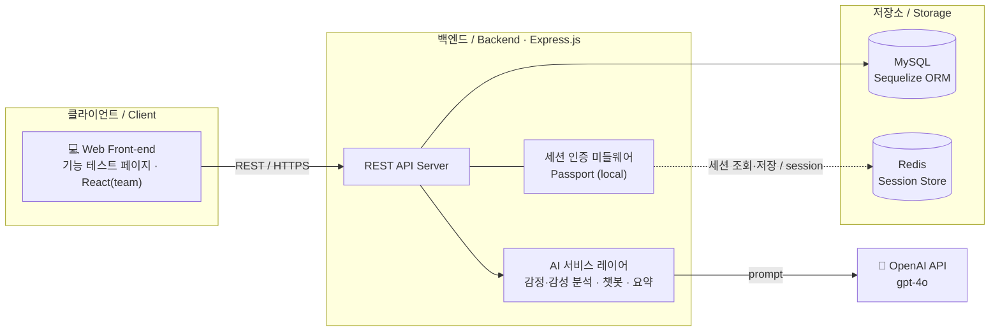
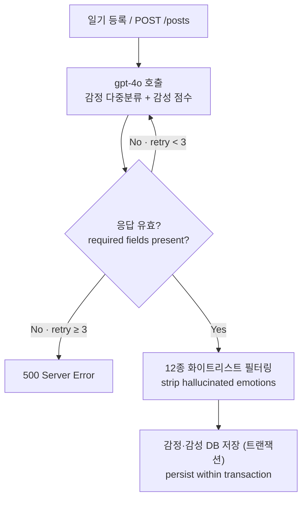
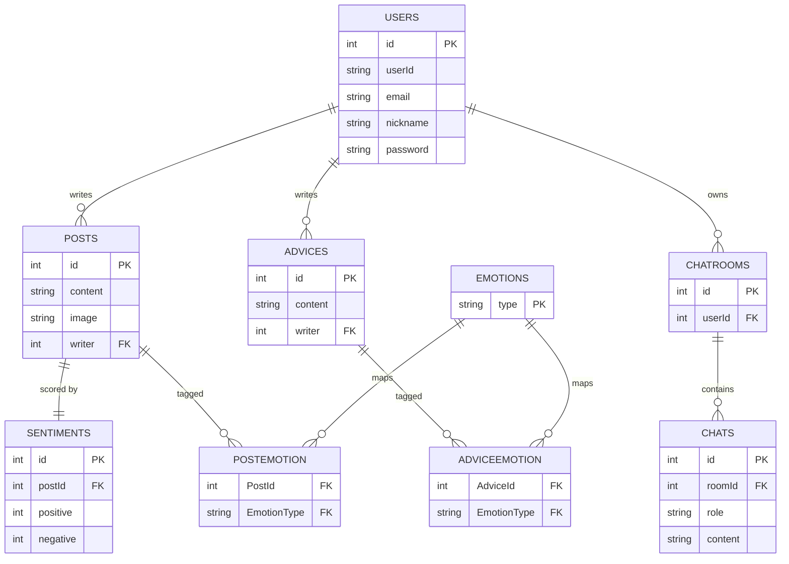

<div align="center">

# 공감 다이어리 · Empathy Diary


**AI 기반 감정 분석 일기 서비스 · 대화로 쓰는 일기, 감정으로 잇는 사람들**

**An AI-powered emotion-analysis diary — write through conversation, connect through feelings**

<br/>


`2024.03 ~ 2024.06` · `Team of 4 (FE 1 · BE 1 · AI 2)` · `Back-end · Team Lead` · `서강대학교 전공 프로젝트 / Sogang University Course Project`

</div>

---

## 📌 개요 / Overview

**KO** — `공감 다이어리`는 사용자가 작성한 일기의 감정을 AI로 분석해 감정 상태를 추적하고, AI 챗봇과 대화를 나누며 그 대화를 일기로 요약해 주는 일기장 서비스입니다. 같은 감정 또는 반대 감정을 느낀 다른 사용자에게 익명으로 조언을 건넬 수 있다는 점이 특징입니다. 백엔드 측면에서는 **REST API 서버를 구축하고 단위·통합·부하 테스트를 고루 수행하여 JavaScript + Node.js 환경 개발의 한계를 보완하는 것**을 목표로 삼았습니다.

**EN** — `Empathy Diary` is a diary service that analyzes the emotions in a user's entry with AI to track emotional state, and lets users write diaries by chatting with an AI assistant that summarizes the conversation into an entry. A distinctive feature is anonymous advice exchange between users who felt similar or opposite emotions. On the backend side, the goal was to **build a REST API server and complement the limits of JavaScript + Node.js development through balanced unit, integration, and load testing.**

---

## 👤 담당 역할 / My Role

> **Back-end · Team Lead** — REST API 설계·구현, AI 연동, 인증, 테스트, 문서화 전반
> **Back-end · Team Lead** — REST API design & implementation, AI integration, auth, testing, and documentation

- **REST API 설계·구현 / REST API** — 일기·감정·감성·조언·대화방·회원 도메인의 엔드포인트 설계 및 구현
- **AI 연동 / AI integration** — OpenAI `gpt-4o` 기반 감정 다중 분류·감성 점수 산출·챗봇 응답·일기 요약, 환각 통제 로직 포함
- **세션 인증 / Session auth** — Passport(local) + Redis 세션 스토어 기반 로그인
- **테스트 / Testing** — Jest·Supertest 단위·통합 테스트, Artillery 부하 테스트
- **문서화 / Documentation** — 설계·API·테스트 문서 작성으로 프론트엔드 연동 효율화

---

## 🛠 기술 스택 / Tech Stack

| 구분 / Category | 사용 기술 / Technologies |
| :--- | :--- |
| **Runtime** | Node.js |
| **Framework** | Express.js |
| **Database** | MySQL (Sequelize ORM) |
| **Session Store** | Redis (`connect-redis`) |
| **AI** | OpenAI API (`gpt-4o`) |
| **Auth** | Passport (local strategy) · express-session |
| **Testing** | Jest · Supertest (unit/integration) · Artillery (load) |
| **Deploy** | AWS EC2 · HTTPS (custom domain) |
| **Front-end** *(team)* | — |

---

## ✨ 주요 기능 / Key Features

- **AI 감정 분석 / AI emotion analysis** — 일기 내용을 12종 감정으로 다중 분류하고, 합이 100이 되는 긍정·부정 감성 점수를 산출
  Multi-labels each entry into 12 emotion types and computes positive/negative sentiment scores summing to 100.
- **AI 챗봇 일기 작성 / Conversational diary writing** — 챗봇과의 대화를 기반으로 사용자의 경험과 감정을 담은 일기를 자동 요약·생성
  Generates a diary from the user's chat with the assistant, capturing experiences and emotions.
- **조언 시스템 / Advice system** — 같은 감정 또는 반대 감정을 느낀 사용자에게 익명 조언을 작성·전달
  Lets users send anonymous advice to others who felt similar or opposite emotions.
- **감정·감성 추이 추적 / Emotion & sentiment trends** — 누적 감정 집계 및 특정 기간 일별 감성 점수 평균 조회
  Aggregates cumulative emotions and daily-average sentiment over a chosen period.

---

## 🏗 시스템 아키텍처 / System Architecture


```mermaid
flowchart LR
    subgraph Client["클라이언트 / Client"]
        FE["💻 Web Front-end<br/>기능 테스트 페이지 · React(team)"]
    end

    subgraph Server["백엔드 / Backend · Express.js"]
        API["REST API Server"]
        AUTH["세션 인증 미들웨어<br/>Passport (local)"]
        AIL["AI 서비스 레이어<br/>감정·감성 분석 · 챗봇 · 요약"]
    end

    subgraph Storage["저장소 / Storage"]
        DB[("MySQL<br/>Sequelize ORM")]
        REDIS[("Redis<br/>Session Store")]
    end

    OPENAI["🤖 OpenAI API<br/>gpt-4o"]

    FE -->|REST / HTTPS| API
    API --- AUTH
    AUTH -.->|세션 조회·저장 / session| REDIS
    API --> AIL
    AIL -->|prompt| OPENAI
    API --> DB
```

---

## 🤖 AI 분석 파이프라인 / AI Analysis Pipeline

**KO** — LLM 응답은 본질적으로 불확실하므로, 일기 등록 시 **응답 유효성 검증 → 최대 3회 재시도 → 12종 화이트리스트 필터링**의 방어적 파이프라인을 두어 환각으로 생성된 비정상 감정을 데이터베이스 저장 전에 제거합니다.

**EN** — Since LLM responses are inherently uncertain, entry creation runs a defensive pipeline — **response validation → up to 3 retries → 12-emotion whitelist filtering** — removing hallucinated, out-of-spec emotions before they ever reach the database.


```mermaid
flowchart TD
    A["일기 등록 / POST /posts"] --> B["gpt-4o 호출<br/>감정 다중분류 + 감성 점수"]
    B --> C{"응답 유효?<br/>required fields present?"}
    C -->|No · retry &lt; 3| B
    C -->|No · retry ≥ 3| E["500 Server Error"]
    C -->|Yes| D["12종 화이트리스트 필터링<br/>strip hallucinated emotions"]
    D --> F["감정·감성 DB 저장 (트랜잭션)<br/>persist within transaction"]
```

---

## 🗄 데이터 모델 / Data Model

**KO** — MySQL을 사용해 일기–감정, 조언–감정의 **다대다 관계**를 `PostEmotion`, `AdviceEmotion` 매핑 테이블로 표현했습니다. 일기의 감성 점수는 일기당 1:1로 매핑되며, 사용자는 AI 챗봇과의 대화방을 통해 일기 작성을 시작합니다.

**EN** — Using MySQL, **many-to-many** relations (post–emotion, advice–emotion) are modeled via `PostEmotion` and `AdviceEmotion` mapping tables. Each post maps 1:1 to a sentiment score, and users begin writing through a chatroom with the AI assistant.


```mermaid
erDiagram
    USERS ||--o{ POSTS : "writes"
    USERS ||--o{ ADVICES : "writes"
    USERS ||--o{ CHATROOMS : "owns"
    CHATROOMS ||--o{ CHATS : "contains"
    POSTS ||--|| SENTIMENTS : "scored by"
    POSTS ||--o{ POSTEMOTION : "tagged"
    EMOTIONS ||--o{ POSTEMOTION : "maps"
    ADVICES ||--o{ ADVICEEMOTION : "tagged"
    EMOTIONS ||--o{ ADVICEEMOTION : "maps"

    USERS {
        int id PK
        string userId
        string email
        string nickname
        string password
    }
    POSTS {
        int id PK
        string content
        string image
        int writer FK
    }
    ADVICES {
        int id PK
        string content
        int writer FK
    }
    EMOTIONS {
        string type PK
    }
    POSTEMOTION {
        int PostId FK
        string EmotionType FK
    }
    ADVICEEMOTION {
        int AdviceId FK
        string EmotionType FK
    }
    SENTIMENTS {
        int id PK
        int postId FK
        int positive
        int negative
    }
    CHATROOMS {
        int id PK
        int userId FK
    }
    CHATS {
        int id PK
        int roomId FK
        string role
        string content
    }
```

---

## 🔌 API 개요 / API Overview

**KO** — 모든 엔드포인트는 **발생 가능한 예외 응답(400·403·404·409·500)을 명세**하여 문서화했습니다. 인증이 필요한 엔드포인트는 세션 검증을 거칩니다.

**EN** — Every endpoint is documented with its **possible exception responses (400·403·404·409·500)**. Authenticated endpoints pass through session verification.

| Domain | 대표 엔드포인트 / Representative Endpoints |
| :--- | :--- |
| **Users** | `POST /users` · `POST /users/login` · `PATCH /users` · `DELETE /users` · `POST /users/logout` |
| **Posts** | `GET /posts` · `POST /posts` · `PATCH /posts` · `DELETE /posts/:postId` · `GET /posts/period` |
| **Advices** | `GET /advices/today` · `GET /advices/me` · `POST /advices` · `PATCH /advices` · `DELETE /advices/:adviceId` |
| **Emotions** | `GET /emotions` · `GET /emotions/period` |
| **Sentiments** | `GET /sentiments/period` |
| **Chatrooms** | `POST /chatrooms` · `POST /chatrooms/summarize` · `GET /chatrooms` · `POST /chatrooms/chats` |

> 전체 명세는 [API 문서](./docs/API.md)를 참고하세요. / See the full [API specification](./docs/API.md).

---

## 🧪 테스트 전략 / Testing Strategy

**KO** — **Line-by-Line 테스트 원칙** 하에 컨트롤러의 모든 예외 분기(각 `findOne`/`create`/`save`/`destroy` 실패 경로)와 인증 미들웨어를 검증하는 단위·통합 테스트를 작성하여 **테스트 커버리지 최대 90%**를 달성했습니다. 시연을 대비해 서버에 부하를 주는 사용자 시나리오를 구성하고 Artillery로 부하 테스트를 수행한 뒤 EC2 인스턴스를 스케일업하여 안정적인 시연 환경을 확보했습니다.

**EN** — Following a **line-by-line testing principle**, unit and integration tests verify every controller exception branch (each failing `findOne`/`create`/`save`/`destroy` path) and the auth middleware, reaching **up to 90% coverage**. For the demo, load scenarios were built and run with Artillery, then the EC2 instance was scaled up to secure a stable demonstration environment.

| Level | Tool | Scope |
| :--- | :--- | :--- |
| **Unit** | Jest | 컨트롤러·모델·미들웨어 / controllers · models · middlewares |
| **Integration** | Supertest | 사용자 시나리오 단위 API 흐름 / scenario-based API flows |
| **Load** | Artillery | 시연 환경 부하 검증 / demo-environment stress |

> 상세는 [테스트 계획](./docs/TestPlan.md) · [단위 테스트](./docs/UnitTest.md) · [통합 테스트](./docs/IntegrationTest.md) 문서를 참고하세요.

---

## 💡 주요 문제 해결 / Key Problem-Solving

**1. 서드파티 쿠키 차단 문제 / Third-party cookie blocking**
백엔드만 배포된 상태에서 로컬 프론트엔드로 로그인하면 세션 쿠키가 서드파티로 분류되어 로그인이 불가능했습니다. AWS EC2 배포 서버에 도메인을 연결하고 HTTPS를 적용한 뒤 쿠키를 `Secure: true`, `SameSite: None`으로 설정하여 해결했습니다.
With only the backend deployed, logging in from a local front-end failed because the session cookie was treated as third-party. I attached a domain to the EC2 server, applied HTTPS, and set the cookie to `Secure: true`, `SameSite: None` to resolve it.

**2. 통합 테스트 중단 현상의 근본 원인 추적 / Root-causing integration-test hangs**
한 테스트 파일에 `describe`가 5개를 넘으면 모든 테스트가 통과한 뒤 프로세스가 멈추는 현상이 있었습니다. 처음에는 라이브러리 결함을 의심해 [이슈](https://github.com/forwardemail/supertest/issues/839)까지 등록했으나, `--detectOpenHandles`로 재조사한 결과 실제 원인은 컨트롤러들이 트랜잭션을 `try` 최상단에서 열고 검증 실패 시 `commit`/`rollback` 없이 early-return하여 커넥션이 누수되고, **Sequelize 기본 커넥션 풀(5)이 고갈**된 것이었습니다. 트랜잭션 스코프를 실제 쓰기 직전으로 한정하여 해결했습니다.
Beyond 4–5 `describe` blocks per file, the process hung after all tests passed. I first suspected the library and even filed an [issue](https://github.com/forwardemail/supertest/issues/839), but `--detectOpenHandles` revealed the real cause: controllers opened a transaction at the top of the `try` block and early-returned on validation failure without `commit`/`rollback`, leaking connections until **Sequelize's default pool (5) was exhausted**. I resolved it by narrowing each transaction's scope to just before the actual writes.

---

## 📁 프로젝트 구조 / Project Structure

```
.
├── backend/                # Express.js 백엔드 / Backend
│   ├── controllers/        # 비즈니스 로직 (user · post · advice · emotion · sentiment · chatroom)
│   ├── models/             # Sequelize 모델 (User · Post · Advice · Emotion · Sentiment · Chatroom · Chat ...)
│   ├── routes/             # API 라우터 / API routers
│   ├── middlewares/        # 인증 미들웨어 / auth middleware
│   ├── services/           # openai.js — AI 감정·감성 분석 / chatbot / 요약
│   ├── public/             # 기능 테스트용 정적 페이지 / static test pages
│   └── server.js           # 엔트리 포인트 / entry point
└── docs/                   # 설계 · API · 테스트 문서 / Design · API · Test docs
    ├── API.md
    ├── Database.md
    ├── TestPlan.md
    ├── UnitTest.md
    └── IntegrationTest.md
```

---

## 📚 문서 / Documentation

- 🗄 [데이터베이스 구조 / Database](./docs/Database.md)
- 🔌 [API 명세 / API Specification](./docs/API.md)
- ✅ [테스트 계획 / Test Plan](./docs/TestPlan.md)
- 🧩 [단위 테스트 / Unit Test](./docs/UnitTest.md)
- 🔗 [통합 테스트 / Integration Test](./docs/IntegrationTest.md)

---

## ⚙️ 환경 변수 / Environment Variables

백엔드 실행 시 `.env` 파일에 다음 값이 필요합니다.
The backend requires the following values in a `.env` file.

```env
PORT=

COOKIE_SECRET=

DB_HOST=
DB_USER=
DB_PASSWORD=
DB_NAME=

REDIS_HOST=
REDIS_PORT=
REDIS_PASSWORD=
```

---

## 🔁 회고 / Retrospective

**배운 점 / What I learned**
- Redis로 세션을 캐싱하여 세션 기반 로그인을 확장성 있게 구성하는 방법을 익혔습니다.
- LLM 연동 시 응답 검증·재시도·화이트리스트 필터링으로 환각을 통제하는 방어적 설계의 중요성을 체감했습니다.

**개선 방향 / What I'd improve**
- 우수한 기획 대비 구현 기능의 폭이 좁았던 점 — 테스트 작성에 몰두하기보다 핵심 기능의 범위를 먼저 균형 있게 확보할 것.
- 첫 팀 리딩 경험에서 책임 분배가 고르지 못했던 점 — 이후 프로젝트에서는 역할과 성장 기회를 의도적으로 균등하게 배분.