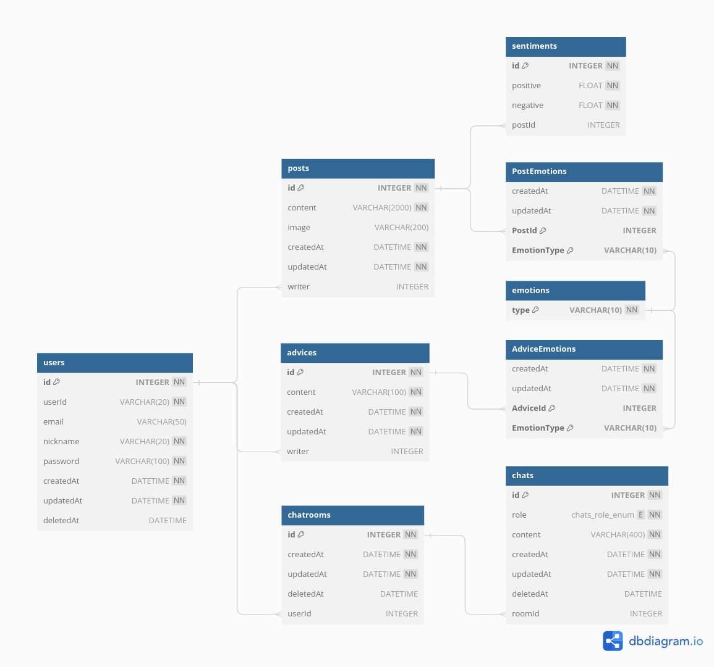

## 데이터베이스 구조

### users: 사용자 테이블
| column | meaning |
| :-- | :-- |
| id | 로우 고유의 ID |
| userId | 로그인 시 사용되는 ID |
| email | 이메일 |
| nickname | 닉네임 |
| password | 비밀번호 |
| createdAt | 로우 생성 일시 |
| updatedAt | 로우 업데이트 일시 |
| deletedAt | 로우 삭제 일시 |

### advices: 조언 테이블
| column | meaning |
| :-- | :-- |
| id | 로우 고유의 ID |
| content | 조언 내용 |
| createdAt | 로우 생성 일시 |
| updatedAt | 로우 업데이트 일시 |
| writer | 조언 작성자 |

사용자는 일기를 작성한 후 자신과 비슷하거나 반대되는 감정을 가진 사람에게 조언할 수 있다.

### posts: 일기 테이블
| column | meaning |
| :-- | :-- |
| id | 로우 고유의 ID |
| content | 일기 내용 |
| image | 첨부된 이미지 경로 |
| createdAt | 로우 생성 일시 |
| updatedAt | 로우 업데이트 일시 |
| writer | 일기 작성자 |

사용자는 일기를 작성할 수 있다.

### emotions: 감정 테이블
| column | meaning |
| :-- | :-- |
| type | 감정 명칭 |

일기에는 행복, 슬픔 등 여러 가지 감정이 매핑될 수 있다.

### PostEmotion: 감정과 일기의 다대다 매핑 테이블
| column | meaning |
| :-- | :-- |
| PostId | 일기의 고유한 ID |
| EmotionType | 감정 명칭 |
| createdAt | 로우 생성 일시 |
| updatedAt | 로우 업데이트 일시 |

행복, 슬픔 등의 특정한 감정은 어떤 일기에도 매핑될 수 있다.

### AdviceEmotion: 감정과 조언의 다대다 매핑 테이블
| column | meaning |
| :-- | :-- |
| AdviceId | 조언의 고유한 ID |
| EmotionType | 감정 명칭 |
| createdAt | 로우 생성 일시 |
| updatedAt | 로우 업데이트 일시 |

행복, 슬픔 등의 특정한 감정은 어떤 조언에도 매핑될 수 있다.

### sentiments: 감성 테이블
| column | meaning |
| :-- | :-- |
| postId | 일기의 고유한 ID |
| positive | 긍정 확률 |
| negative | 부정 확률 |

일기의 내용으로 감성 분석을 수행하면 긍정적일 확률, 부정적일 확률, 중립적일 확률이 추출된다. 이 정보는 일기마다 고유하게 매핑된다.

### chatrooms: 대화방 테이블
| column | meaning |
| :-- | :-- |
| id | 로우 고유의 ID |
| userId | 대화 사용자 ID |
| createdAt | 대화 시작 일시 |
| updatedAt | 로우 수정 일시 |
| deletedAt | 로우 삭제 일시 |

사용자는 일기를 작성하기 위해 AI 챗봇과 대화를 시작할 수 있다. 이때 대화방이 생성된다.

### chats: 대화 테이블
| column | meaning |
| :-- | :-- |
| id | 로우 고유의 ID |
| roomId | 대화방의 ID |
| role | 메시지 생성자(AI or 사용자) |
| content | 메시지 내용 |
| createdAt | 대화 전송 일시 |
| updatedAt | 로우 수정 일시 |
| deletedAt | 로우 삭제 일시 |